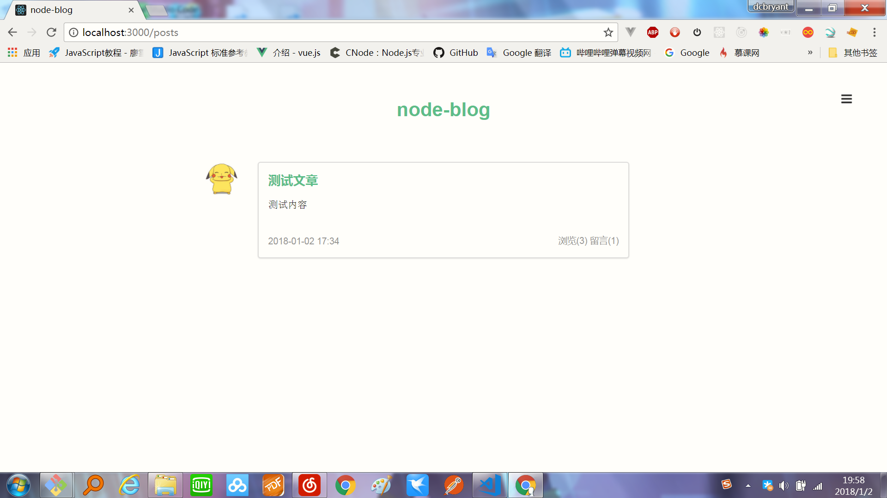
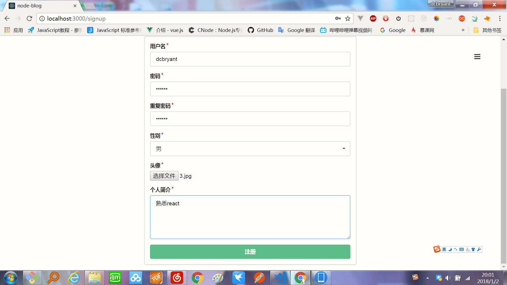
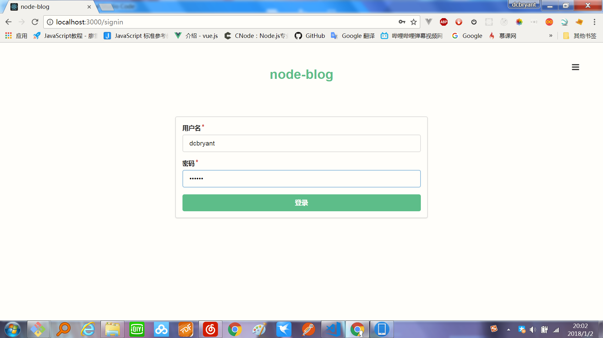
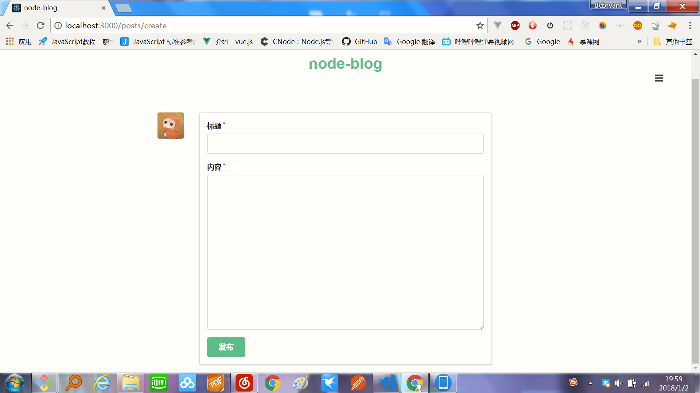
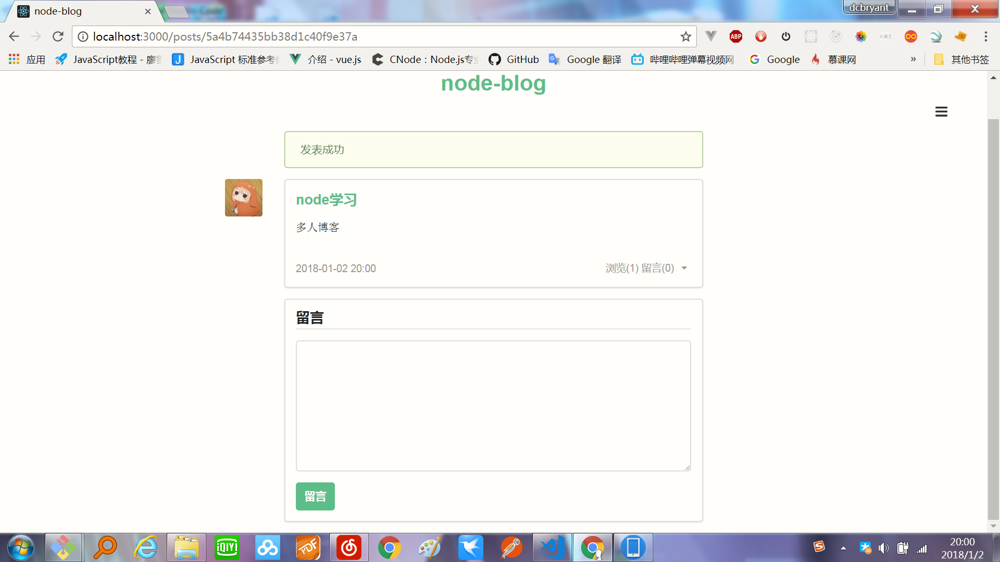

# 介绍

使用node搭建的一个多人博客，使用的是express框架，模板是ejs,数据库使用的是mongoDB,包含注册、登陆、登出、发布文章、编辑文章、删除文章、添加留言、删除留言、增加日志等等功能。本项目学习于nswbmw的开源作品，若想学习，请直接访问[N-blog](https://github.com/nswbmw/N-blog)

# 使用

```bash
git clone 

cd node-blog 

cnpm i

node index.js
```

###
本地项目运行截图










